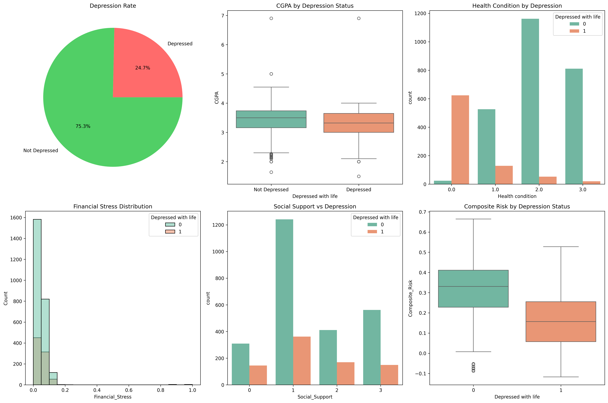
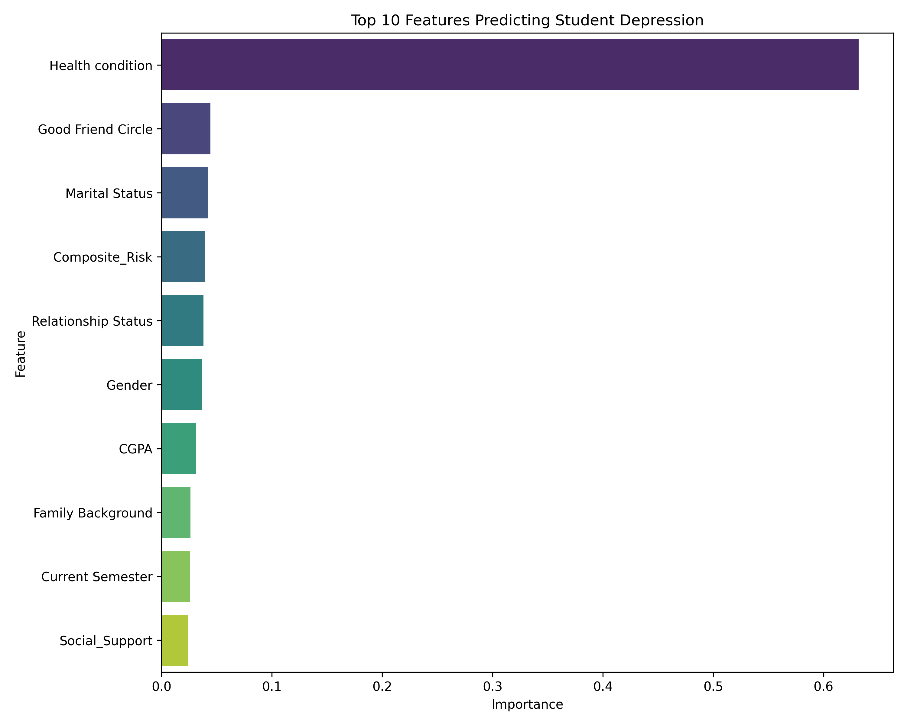
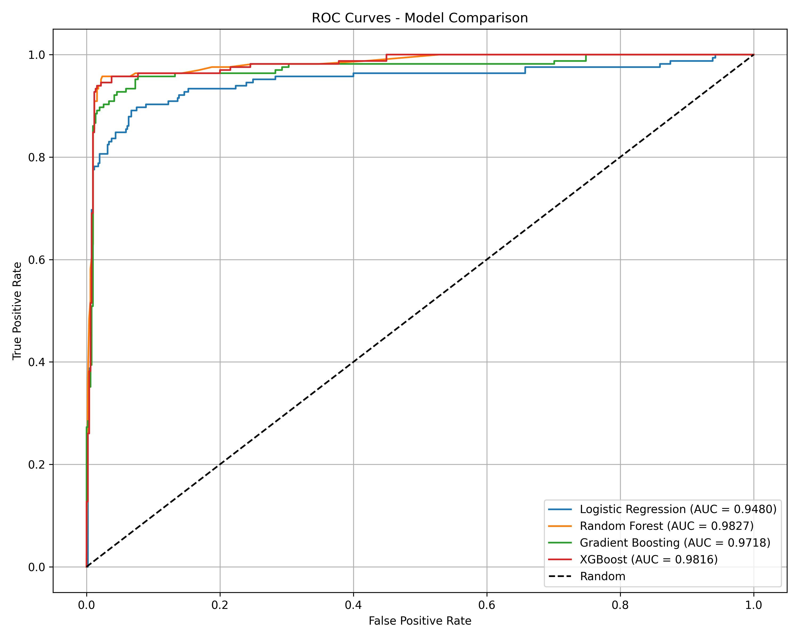
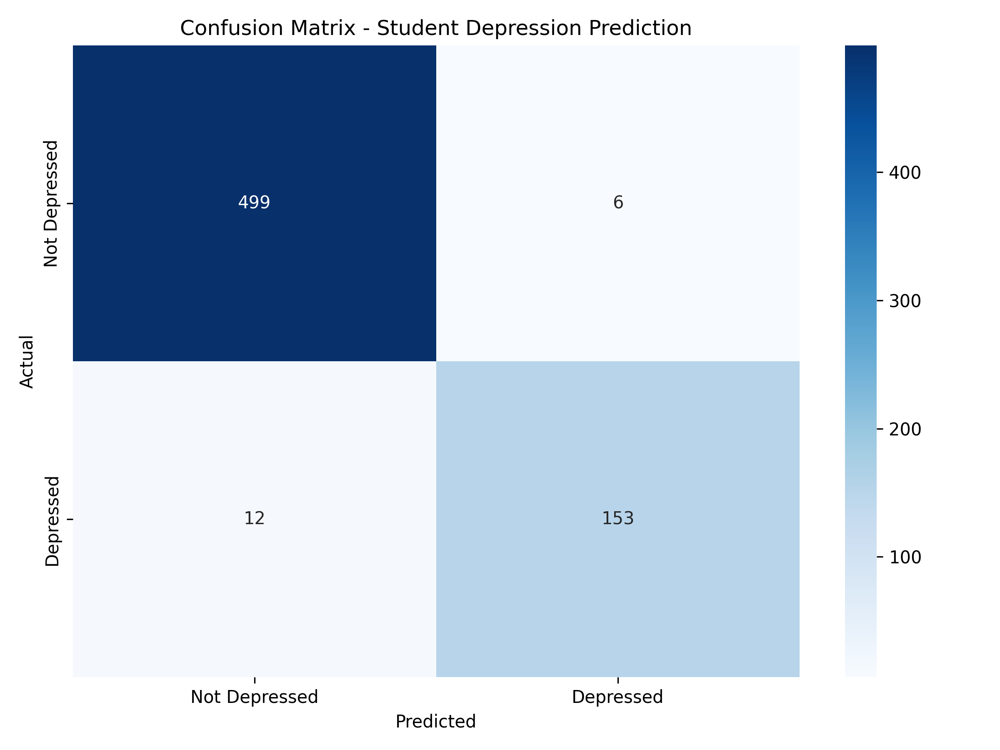

# Student Mental Health Prediction

## Overview

I built this project to explore a question that matters to me: what actually predicts depression in university students? Using a dataset of over 3,000 students, I cleaned and analysed the data, created new features from the raw information, and trained several machine learning models to see which factors mattered most. The results were clear health, academic pressure, and financial stress all play a significant role, while social support acts as a protective factor. I built this pipeline to develop my skills across the entire data science process, from cleaning messy data to drawing useful conclusions.

---

## Dataset

- **Source:** Mendeley Data
- **Rows:** 3,350 students
- **Features:** 12 (demographics, CGPA, health, lifestyle)
- **Target:** Depression (Yes/No)


---

## Methodology

1. **Data Cleaning** – Handled missing values, stripped whitespace from column names, converted data types
2. **Feature Engineering** – Created 6 new features (Academic Stress, Financial Stress, Social Support, Health Risk, Semester Pressure, Composite Risk)
3. **EDA** – Visualised relationships between features and depression
4. **Class Imbalance** – Applied SMOTE to balance training data
5. **Modelling** – Trained 4 models (Logistic Regression, Random Forest, Gradient Boosting, XGBoost)
6. **Hyperparameter Tuning** – GridSearchCV for XGBoost
7. **Cross-Validation** – 5-fold StratifiedKFold
8. **Evaluation** – Accuracy, Precision, Recall, F1, ROC AUC

---

## Results

| Model | Accuracy | ROC AUC |
| :--- | :--- | :--- |
| Logistic Regression | 0.879 | 0.948 |
| Random Forest | 0.972 | 0.983 |
| Gradient Boosting | 0.960 | 0.972 |
| **XGBoost (tuned)** | **0.973** | **0.985** |

**Best parameters:** `learning_rate=0.2, max_depth=7, n_estimators=100, subsample=0.8`

**Cross-validation ROC AUC:** 0.9898 (+/- 0.0024)

---

## Key Findings

- **Health condition** is the strongest predictor of depression (63% importance)
- **Good friend circle** and **marital status** also significantly impact mental health
- **Composite risk score** (combining multiple factors) improves prediction
- **Social support** acts as a protective factor

### Top 10 Features

| Rank | Feature | Importance |
| :--- | :--- | :--- |
| 1 | Health condition | 0.632 |
| 2 | Good Friend Circle | 0.044 |
| 3 | Marital Status | 0.042 |
| 4 | Composite Risk | 0.039 |
| 5 | Relationship Status | 0.038 |
| 6 | Gender | 0.036 |
| 7 | CGPA | 0.031 |
| 8 | Family Background | 0.026 |
| 9 | Current Semester | 0.026 |
| 10 | Social Support | 0.024 |

---

## Visualisations

### Exploratory Data Analysis


### Feature Importance


### ROC Curves


### Confusion Matrix


---

## Model Files

The trained model and scaler are saved in the `models/` folder:

- `student_depression_model.pkl` – Tuned XGBoost model
- `scaler.pkl` – Feature scaler

To load them in Python:

```python
import joblib
model = joblib.load('models/student_depression_model.pkl')
scaler = joblib.load('models/scaler.pkl')
